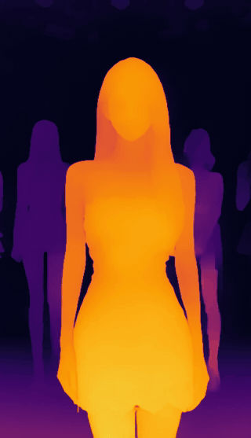

# 蝉镜AI DeepVideo

**把普通视频转换为时序一致的可视化深度视频 — 支持 macOS 与 Windows 本地运行**

**简体中文** · [English](./README.md)

[下载最新版](https://github.com/agidesigner/chanjing-deepvideo/releases/latest)

**最新版本：[v1.5.1](https://github.com/agidesigner/chanjing-deepvideo/releases/tag/v1.5.1)**

<h2>Before / After · 效果预览</h2>

<strong>原视频 → 时序一致深度视频</strong>

<table>
  <tr>
    <th width="50%">Before · 原视频</th>
    <th width="50%">After · 深度视频</th>
  </tr>
  <tr>
    <td align="center"></td>
    <td align="center"></td>
  </tr>
  <tr>
    <td align="center"><a href="./media/deepvideo-before.mp4">下载原视频 MP4</a></td>
    <td align="center"><a href="./media/deepvideo-after-depth.mp4">下载深度视频 MP4</a></td>
  </tr>
</table>

预览会自动循环播放，也可以下载上方 MP4 原文件。

> 此仓库仅发布安装包和版本说明，不包含应用源代码。

## 下载

- **macOS · Apple Silicon**：[下载 DMG](https://github.com/agidesigner/chanjing-deepvideo/releases/download/v1.5.1/Chanjing-DeepVideo-1.5.1-arm64.dmg)
- **Windows · CPU 版**：[下载安装包](https://github.com/agidesigner/chanjing-deepvideo/releases/download/v1.5.1/JoggAI-DeepVideo-1.5.1-Windows-x64-CPU-Setup.exe) — 下载更小，适用于支持的 x64 电脑。
- **Windows · NVIDIA GPU 版**：[下载 CUDA 安装包](https://github.com/agidesigner/chanjing-deepvideo/releases/download/v1.5.1/JoggAI-DeepVideo-1.5.1-Windows-x64-Setup.exe) — 适合配备受支持 NVIDIA 显卡及较新驱动的电脑。

Windows 两个版本选择一个安装即可。CPU 版约 245 MB；NVIDIA 版约 1.46 GB，CUDA 不可用时也会回退到 CPU。

蝉镜AI DeepVideo 是一款面向创作者的本地视频深度生成工具。选择视频后，应用会在电脑上逐帧估计画面深度，生成具有稳定时序效果的彩色深度视频。Small 模型已包含在安装包内，安装完成后无需再次下载模型。

## 核心功能

- **本地 AI 处理**：视频和生成结果保留在本机，不上传到云端。
- **时序一致的深度估计**：减少逐帧处理常见的闪烁，适合连续视频素材。
- **模型随 App 内置**：安装后即可使用，不需要配置 Python、Conda 或命令行环境。
- **可感知的生成进度**：显示处理阶段、帧数、百分比、已用时间和预计剩余时间。
- **应用内结果预览**：生成后可直接播放深度视频，并一键打开输出文件夹。
- **中英文界面**：中文系统显示简体中文，其他系统语言显示英文。
- **应用内更新提醒**：发现新版本时显示下载入口，也可从应用菜单手动检查更新。

## 适用场景

- **三维视差与空间动画**：为照片动画、镜头推进和 2.5D 视觉效果提供深度参考。
- **影视合成与特效**：辅助景深、雾效、光照、遮挡和分层合成。
- **深度感知剪辑**：为前后景分离、区域蒙版和风格化处理提供基础素材。
- **AI 视频创作**：将深度视频用于 ControlNet、生成式视频及其他视觉工作流。
- **快速预演**：无需搭建开发环境，快速判断一段素材的空间层次与深度稳定性。

> 当前版本生成的是**相对深度可视化**，不代表真实世界的绝对距离或测量结果。

## 系统要求

- **macOS**：Apple Silicon M1 或更新芯片；macOS 12.3 或更高版本
- **Windows**：Windows 10 2004 或更高版本；64 位 x86 电脑（不支持 Windows ARM）
- **GPU 版**：建议安装较新的 NVIDIA 显卡驱动；没有 NVIDIA 显卡时建议下载体积更小的 CPU 版
- 建议至少 8 GB 内存；高质量模式建议 16 GB 或更多
- 输入格式：常见 MP4、MOV、M4V、AVI、MKV 视频（推荐 H.264 MP4/MOV）

## 安装与使用

### macOS

1. 下载 DMG，将“蝉镜AI DeepVideo”拖入“应用程序”。
2. 首次启动若 macOS 显示安全提示，请在 Finder 中右键应用并选择“打开”。

### Windows

1. 从上方选择 CPU 版或 NVIDIA GPU 版安装包。
2. 在 [v1.5.1 发布页面](https://github.com/agidesigner/chanjing-deepvideo/releases/tag/v1.5.1)下载对应 `.sha256` 文件并核对。
3. 运行安装程序。当前 Windows 安装包尚未签名，系统可能显示“未知发布者”或 SmartScreen 提示。

安装后选择输入视频和输出文件夹，设置生成质量并开始处理。完成后可在应用内预览，或点击“打开输出文件夹”。

每次生成会输出：

- `原文件名_src.mp4`：标准化后的源视频
- `原文件名_depth.mp4`：彩色深度视频

## 版本更新

应用会自动检查本仓库的新版本。也可以随时通过 macOS 应用菜单或 Windows“帮助”菜单中的“检查更新”手动检查。发现新版本后，DeepVideo 会打开最新 GitHub Release，用户下载安装即可；应用不会静默安装更新。

更多 AI 视频创作能力，请访问 [蝉镜官网](https://chanjing.cc/?source=deepvideo)。

## 技术与分发说明

深度估计能力基于 [Video Depth Anything](https://github.com/DepthAnything/Video-Depth-Anything)。第三方组件与模型仍分别遵循其原始许可证。DeepVideo 应用以专有软件形式分发；下载安装包或使用应用不代表获得其源代码访问权。
